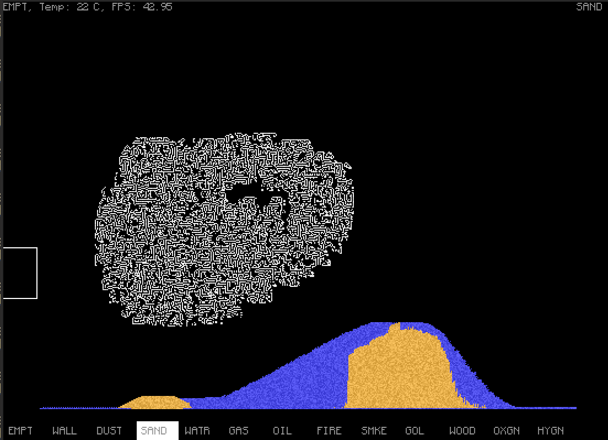

# Crumb

# Dependencies
Make sure you have the libsdl2 and sdl2-ttf libraries installed

# How to run Crumb
`cargo run --release`

and that's it

# CREDITS

A lot of the base code for the engine comes from https://github.com/MaxBittker/sandspiel